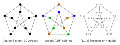
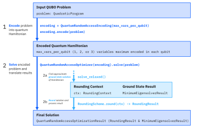

[](https://www.python.org/)
[](https://github.com/Qiskit/qiskit)
[](https://github.com/Qiskit/qiskit-optimization)
[](https://github.com/qiskit-community/prototype-qrao/blob/main/LICENSE.txt)
[](https://github.com/psf/black)
[](https://github.com/qiskit-community/prototype-qrao/actions/workflows/test_latest_versions.yml)
[](https://coveralls.io/github/qiskit-community/prototype-qrao?branch=main)

<p align="center">
  
  <p align="center">
   <a href="https://mybinder.org/v2/gh/qiskit-community/prototype-qrao/HEAD?labpath=docs%2Ftutorials%2F01_getting_started.ipynb">
     
   </a>
  </p>
</p>
<h2 align="center">Quantum Random Access Optimization</h2>

### Table of Contents

* [About This Project](#about-this-project)
* [Installation](#installation)
* [Documentation](#documentation)
  - [Tutorials](docs/tutorials/)
  - [How-Tos](docs/how_tos/)
  - [Background](docs/background/README.md)
  - [API Reference](https://qiskit-community.github.io/prototype-qrao/apidocs/)
* [Important Usage Notes](#important-usage-notes)
* [How to Give Feedback](#how-to-give-feedback)
* [Contribution Guidelines](#contribution-guidelines)
* [Acknowledgements](#acknowledgements)
* [About Prototypes](#about-prototypes)
* [Deprecation Policy](#deprecation-policy)
* [References](#references)
* [License](#license)

----------------------------------------------------------------------------------------------------

### About This Project

The Quantum Random Access Optimization (QRAO) module is designed to enable users to leverage a new quantum method for combinatorial optimization problems. This approach incorporates Quantum Random Access Codes (QRACs) as a tool to encode multiple classical binary variables into a single qubit, thereby saving quantum resources and enabling exploration of larger problem instances on a quantum computer. The encodings produce a local quantum Hamiltonian whose ground state can be approximated with standard algorithms such as [VQE](https://qiskit.org/documentation/tutorials/algorithms/04_vqe_advanced.html) and [QAOA](https://qiskit.org/documentation/tutorials/algorithms/05_qaoa.html), and then rounded to yield approximation solutions of the original problem.

The figure at the top of this page illustrates a simple example of encoding a degree-3 graph with 10 vertices into just 4 qubits, instead of 10. The graph is colored (with a largest-degree-first greedy algorithm) such that adjacent vertices are of a different color. Then, vertices of a given color are encoded using a (3,1,p) QRAC so that a maximum of 3 vertices are associated with a single qubit. Check out the [background documentation](https://github.com/qiskit-community/prototype-qrao/blob/main/docs/background/README.md) to learn more about the coloring algorithm, QRACs, and building associated local quantum Hamiltonians.

This project evolved out of research at IBM Quantum on [Approximate Solutions of Combinatorial Problems via Quantum Relaxations](https://arxiv.org/abs/2111.03167).

***Problem Statement***

Given a [quadratic unconstrained binary optimization](https://en.wikipedia.org/wiki/Quadratic_unconstrained_binary_optimization) (QUBO) problem represented by a relaxation to a local quantum Hamiltonian, find an approximate solution by rounding the energy associated with a candidate ground state. This Hamiltonian is constructed using quantum random access codes for memory compression, which allows each qubit to encode more than one binary variable.

***QRAO Flowchart***

Quantum random access optimization is composed of two main steps as shown in the flowchart below.

1. The input problem is encoded into a quantum Hamiltonian using the `QuantumRandomAccessEncoding` class. The maximum number of original classical binary variables encoded into each qubit is specified by `max_vars_per_qubit`.
2. The encoded problem is solved with the `QuantumRandomAccessOptimizer`, which uses a minimum eigensolver on the quantum Hamiltonian, rounds the solution, and returns the processed results.

<br />

<p align="center">
  
</p>

----------------------------------------------------------------------------------------------------

### Installation

Python 3.6 or higher is required.  Full installation instructions are provided in [`INSTALL.md`](INSTALL.md), but here is a quick summary:

```sh
$ git clone https://github.com/qiskit-community/prototype-qrao.git
$ cd prototype-qrao
$ python3 -m venv venv
$ source venv/bin/activate
$ pip install tox notebook -e '.[notebook-dependencies]'
$ jupyter notebook
```

----------------------------------------------------------------------------------------------------

### Documentation

Documentation is stored in the [`docs/`](docs/) directory.  It is organized according to the [Diátaxis framework](https://diataxis.fr/):

- [Tutorials](docs/tutorials/): longer examples of end-to-end usage
- [How-to guides](docs/how_tos/): targeted answers to common questions
- [Background material](docs/background/README.md): in-depth exploration of theoretical concepts
- [API Reference](https://qiskit-community.github.io/prototype-qrao/apidocs/): documentation of each individual class and function

----------------------------------------------------------------------------------------------------

### Important Usage Notes

The current version of this module has some important usage notes and limitations.

#### Supported Problem Types

As with `qiskit-optimization`, this module currently only supports input problems that are of type `QuadraticProgram` and that can be converted to a QUBO. Furthermore, the conversion to a QUBO must be made _before_ encoding the problem into a quantum Hamiltonian with `QuantumRandomAccessEncoding` (refer to the tutorial to [see an example of this](https://github.com/qiskit-community/prototype-qrao/blob/main/docs/tutorials/01_getting_started.ipynb)).

Check out the documentation for `qiskit-optimization` to see [how to construct a `QuadraticProgram`](https://github.com/Qiskit/qiskit-optimization/blob/main/docs/tutorials/01_quadratic_program.ipynb) and [apply converters to it](https://github.com/Qiskit/qiskit-optimization/blob/main/docs/tutorials/02_converters_for_quadratic_programs.ipynb) (including a [wrapper that converts a `QuadraticProgram` to a QUBO](https://github.com/Qiskit/qiskit-optimization/blob/main/qiskit_optimization/converters/quadratic_program_to_qubo.py)).

#### Statevector Simulator Usage

If you would like to use a statevector simulation for Magic Rounding, we advise using the new `AerSimulator` ([source](https://github.com/Qiskit/qiskit-aer/blob/main/qiskit/providers/aer/backends/aer_simulator.py)) with the `"statevector"` method and _not_ the ([soon-to-be-deprecated](https://github.com/Qiskit/qiskit-aer/blob/73b29ad75a0d206c68aff42d4d63adf3a42b61b5/qiskit/providers/aer/backends/statevector_simulator.py#L178)) `StatevectorSimulator`. The latter suffers from a very poor runtime scaling when used with the Magic Rounding scheme, as it effectively brute-forces all possible solutions.

----------------------------------------------------------------------------------------------------

### How to Give Feedback

We encourage your feedback! You can share your thoughts with us by:
- [Opening an issue](https://github.com/qiskit-community/prototype-qrao/issues) in the repository
- [Starting a conversation on GitHub Discussions](https://github.com/qiskit-community/prototype-qrao/discussions)
- [Filling out our survey](https://airtable.com/shrWnomSunVJTz6PV)


----------------------------------------------------------------------------------------------------

### Contribution Guidelines

For information on how to contribute to this project, please take a look at our [contribution guidelines](CONTRIBUTING.md).


----------------------------------------------------------------------------------------------------

### Acknowledgements

This prototype is based on the research described in [[1]](#references).

The initial codebase was written by Takashi Imamichi, Toshinari Itoko, and Bryce Fuller.


----------------------------------------------------------------------------------------------------

### About Prototypes

[Prototypes](https://qiskit-community.github.io/prototypes/) is a collaboration between developers and researchers that will give users access to prototypes from cutting-edge research in areas like quantum simulation and machine learning. These software packages are built on top of, and may eventually be integrated into the Qiskit SDK. They are a contribution as part of the Qiskit community.

Check out our [blog post](https://medium.com/qiskit/try-out-the-latest-advances-in-quantum-computing-with-ibm-quantum-prototypes-11f51124cb61) for more information!


----------------------------------------------------------------------------------------------------

### Deprecation Policy

Prototypes are meant to evolve rapidly and, as such, do not follow [Qiskit's deprecation policy](https://qiskit.org/documentation/contributing_to_qiskit.html#deprecation-policy).  We may occasionally make breaking changes in order to improve the user experience.  When possible, we will keep old interfaces and mark them as deprecated, as long as they can co-exist with the new ones.  Each substantial improvement, breaking change, or deprecation will be documented in [`NEWS.md`](NEWS.md).


----------------------------------------------------------------------------------------------------

### References

[1] Bryce Fuller, Charles Hadfield, Jennifer R. Glick, Takashi Imamichi, Toshinari Itoko, Richard J. Thompson, Yang Jiao, Marna M. Kagele, Adriana W. Blom-Schieber, Rudy Raymond, and Antonio Mezzacapo. Approximate Solutions of Combinatorial Problems via Quantum Relaxations. [arXiv:2111.03167](https://arxiv.org/abs/2111.03167).


----------------------------------------------------------------------------------------------------

### License
[Apache License 2.0](LICENSE.txt)
